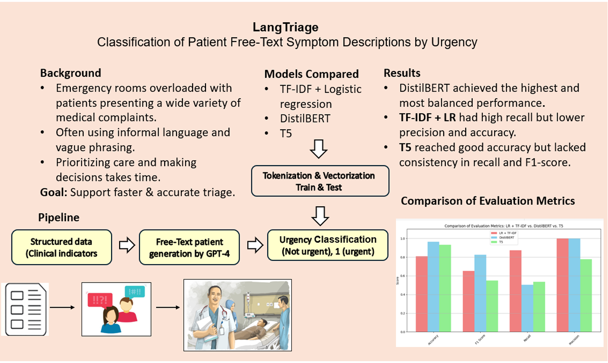

# LangTriage

**LangTriage** is an NLP-based classification project leveraging **Large Language Models (LLMs)** to determine the urgency level of patients based on case descriptions generated from clinical data.
The goal is to quickly and accurately **classify** the case descriptions of patients arriving at the emergency room according to urgency level - urgent (1) vs. non-urgent (0).
Thereby, improve the decision-making process of the medical team regarding triage and ensure that urgent cases are treated first.

## Project Overview

### NLP Tasks: 
* Text classification – Using LLMs to assign urgency labels to patient symptom descriptions.
* Data to Text Generation – from structured clinical data to symptom descriptions.

## Dataset Description:
Source: Patient Priority Classification Dataset (Kaggle) https://www.kaggle.com/datasets/hossamahmedaly/patient-priority-classification

### **Data files:** 
* patient_priority - Raw dataset as provided, includes triage info and clinical indicators
* df_clean_original - Cleaned version with mapped binary labels 
* df_clean_with_text - Final dataset including structured input and free-text complaint

Code Notebooks:
* EDA: NLP_Project_EDA.ipynb
* Free-Text Generation: Generate_free_text_complaints.ipynb
* Training: Train_and_Evaluate_models.ipynb
* Model Comparison: Comparison_of_Model_Performance.ipynb

## Methodology & Modeling  Pipeline:
**1. EDA & Data Cleansing:**

Exploratory Data Analysis (EDA) performed to understand class distribution, missing values, and feature behavior.
Invalid entries and incomplete rows were removed.

**2. Mapping Urgency Levels to Binary Labels:**

Original triage labels were mapped to a binary classification task:

0 — Not Urgent: Can wait or be monitored

1 — Urgent: Requires immediate medical attention

  
**3. Data Generation:**
Structured Prompt was designed for the GPT-4 model to generate natural , first-person, free-text descriptions without medical terms, simulating how a patient might describe their symptoms upon arrival at the emergency room. These were based on the patient’s clinical measurements.
Example prompt:
"You are a patient arriving to the ER. Describe how you feel..."

**4. Vectorization & Modeling:**

Models tested:

**TF-IDF + Logistic Regression**
Baseline model using classical feature extraction (TF-IDF) and a simple linear classifier. Fast and interpretable, but limited in handling semantic meaning.

**DistilBERT (Fine-tuned Transformer)**
Lightweight version of BERT, fine-tuned on the classification task. Captures contextual understanding and showed strong, balanced performance.

**T5 (Fine-tuned Generative Transformer)**
A text-to-text generative model (FLAN-T5), trained to output the urgency class based on free-text input. Allows flexible input-output structure, but less consistent in classification accuracy compared to DistilBERT.

* Text preprocessing included: Lowercasing, Stopword removal, Tokenization & truncation per model, SMOTE for class balancing

Data splitting:
Dividing into 80% training and 20% testing.

**5. Evaluation**
Models were evaluated on the test set using:
* Accuracy, Precision, Recall, F1-Score
* AUROC
* Confusion Matrix & Comparison Charts

## Results: 
* DistilBERT showed the most balanced and highest performance 

* TF-IDF + LR had strong recall, making it highly sensitive to urgent cases

* T5 achieved good accuracy, but was less consistent across F1 and recall

## Conclusions & Recommendations:

**Improving Recall in transformer models:**
Recall was relatively low. Future work can explore threshold tuning or smarter sampling to improve urgent case detection.

**Enhancing synthetic text generation:** Texts can be made more natural and diverse using larger models or clinical fine-tuning.

**Real-world clinical validation:** Test the model in actual ER settings and gather staff feedback on its usefulness in triage decisions.

## **Why LLMs?**  
The use of Large Language Models like DistilBERT and T5 allows for nuanced understanding of patient narratives and enables both discriminative (classification) and generative (symptom description) capabilities. These models bring state-of-the-art NLP to the medical triage context, offering scalability and adaptability beyond rule-based or classical ML approaches.

## Visual Abstract

